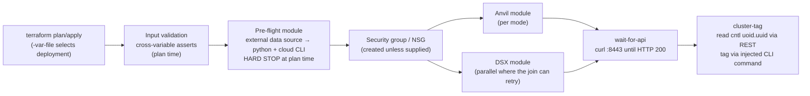
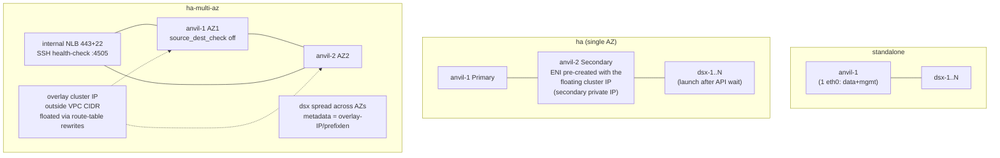
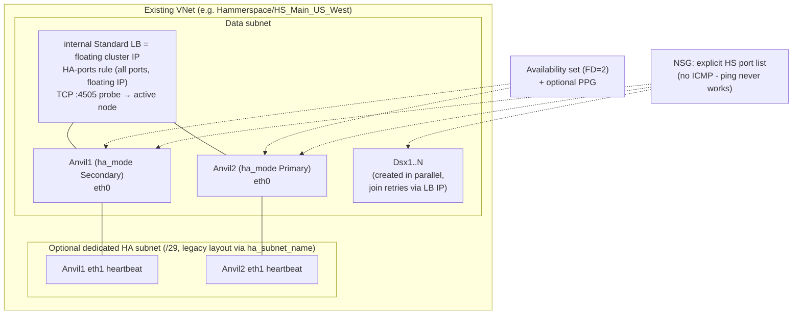

# Hammerspace Terraform — Architecture Overview

Multi-cloud Terraform that provisions Hammerspace **Anvil** (metadata) and
**DSX** (data-services) clusters. Each cloud root is a faithful port of that
cloud's product reference, sharing one execution pipeline and the
cloud-neutral pieces.

| Root | Ported from | Modes |
|---|---|---|
| `aws/` | `hs-anvil-dsx-provision` Ansible playbooks (CFT-modelled) | `standalone`, `ha`, `ha-multi-az`, `dsx` |
| `azure/` | Azure Marketplace ARM template (`mainTemplate`, datasphere `tools/azure/templates`) | `standalone`, `ha`, `dsx` (no multi-az — availability-set design) |
| `shared/` | — | `wait-for-api`, `cluster-tag` (cloud-neutral) |

Both clouds boot nodes with the **same provisioning JSON** (user data /
custom data — one schema, `pd/prov/schema.py`), talk to the same `:8443`
management REST API, and tag every instance with the same
`HammerspaceClusterId`.

## Execution pipeline (identical shape in both roots)

- **`terraform plan` is the dry run** (the Ansible `-e dry_run=true`
  equivalent): every assert and the full pre-flight run without creating
  anything, and a failed check fails the plan.
- **One state per deployment** (directory copy or workspace) — a deployment
  maps to one Ansible run / one ARM deployment; `terraform destroy` removes
  exactly that cluster (state replaces the Ansible `temp_aws_resources_*`
  tracking files).
- The network (VPC/VNet, subnets) must **pre-exist** in both clouds; the
  configs create instances, security groups, LBs, and placement objects only.

## Pre-flight (plan-time hard stop)

| Check | AWS | Azure |
|---|---|---|
| CLI auth | implicit (provider) | `az account show` |
| Deployer permissions | `iam:SimulatePrincipalPolicy` per-mode action list | *(no Azure equivalent — surfaces at apply)* |
| Instance profile / identity | exists + role simulated (HA runtime actions; multi-az adds route-write) | not needed (LB failover is probe-driven) |
| API reachability | EC2 interface endpoint **or** NAT/IGW default route per subnet; VPC DNS attrs | — |
| VM size | via `aws_ec2_instance_type` data source | Resource-SKUs REST call (server-side location filter, 24 h disk cache — sub-second warm) + premium-storage capability |
| Node minimums | root-level `aws_ec2_instance_type` postconditions | SKU `vCPUs`/`MemoryGB` capabilities |
| Image | AMI `hs_version` tag (dsx mode) | image exists; `hs_version` tag optional (warning if absent) |
| Existing cluster (dsx mode) | probe `:8443` + credentials + Major.Minor match | same |
| Topology (multi-az) | az1≠az2, subnets in AZ/VPC, overlay IP outside VPC CIDR, route tables in VPC | — |

Advisory findings surface as **plan warnings** (check block); `skip_preflight
= true` bypasses everything.

## Sizing minimums (enforced at plan time)

| Setting | Minimum | Default (AWS / Azure) |
|---|---|---|
| Anvil instance | 16 vCPU / 32 GiB | `i7ie.6xlarge` / `Standard_F16s_v2` |
| DSX instance | 8 vCPU / 16 GiB | `m5.2xlarge`-class examples / `Standard_F8s_v2` |
| Boot disk (Anvil + DSX) | 512 GB | 512 GB (variable validation) |
| Anvil metadata disk | sized for IOPS | gp3 5000 IOPS / `PremiumV2_LRS` 5000 IOPS + 300 MB/s |

Azure caveat: PremiumV2/Ultra disks cannot attach to availability-set VMs, so
HA Anvil metadata and DSX data disks **transparently fall back** to
`Premium_LRS` (surfaced as a plan warning; size the disk for IOPS —
1024 GB ≈ 5000 IOPS). Standalone Anvils are deliberately not placed in an
availability set so PremiumV2 works there.

## AWS architecture (`aws/`)

Key mechanics kept from the playbooks:

- **Cluster-IP atomicity (ha)**: the Secondary's ENI is pre-created with the
  floating IP (auto-allocated `private_ips_count=1`, or pinned via CLI
  *before* launch), so the IP is in IMDS from boot second 0.
- **Ephemeral detection**: instance-store types (i7ie/r8id/c8id/…) skip the
  metadata/data EBS volumes automatically; boot disk always provisioned.
  1/2/4 gp3 metadata disks (5000 IOPS default) with `raid0`/`raid1` in
  `node.storage.options`.
- Naming `anvil-1-<label>-<5char>`; HA peer discovery resolves by `tag:Name`.
- **Password = the Primary Anvil's EC2 instance ID.**
- Security group is wide open by default (upstream placeholder) — tighten
  for non-lab use.

## Azure architecture (`azure/`)

Azure-specific mechanics (all from the marketplace template):

- **Failover is entirely LB-probe-driven** — no cloud API calls, no
  route rewriting, therefore **no managed identity / instance profile**.
- Standalone = single data NIC, no LB; DSX metadata target =
  `<cluster-ip>/<data-subnet-prefixlen>`.
- **Admin password is user-supplied** (`hs-init-admin-pw` pushed as a
  *create-only* `az vm extension set` step — never uninstalled at destroy),
  not the instance ID.
- Disks are **inline** on the classic `azurerm_virtual_machine` resource so
  they exist at first boot (the modern resource attaches post-boot and would
  race volume discovery). Anvil: boot + 1 metadata disk (lun 1); DSX: boot +
  N data disks, optional `raid0`. `Default` type → Premium_LRS when the size
  supports it.
- **Operational policy encoded in config**: destroys are always forced
  (`skip_shutdown_and_force_delete`, create-only extension), readiness/tagging
  always via the **internal** IP, DSX always parallel with the Anvils.

## Shared modules

- `shared/wait-for-api` — curl loop against `https://<endpoint>:8443` (120×10 s).
- `shared/cluster-tag` — waits for the API, reads the cluster ID
  (`cntl` `uoid.uuid`), then executes a cloud-supplied `tag_command`
  containing the `__CLUSTER_ID__` placeholder
  (`aws ec2 create-tags …` / `az tag update …` loops).

## Verification status

| Path | Status |
|---|---|
| AWS standalone / ha-multi-az / dsx | `terraform plan` verified against the real test account (pre-flight live; dsx hard-stop path proven); no apply yet |
| Azure standalone | **Deployed, verified, destroyed** (Anvil + DSX joined, tagged, internal IP) |
| Azure ha | **Deployed, verified, destroyed** — cluster up in 18 min, 2 ANVIL + 1 DSX + tags, LB floating IP reachable over VPN (`azure/smoke-test-ha-2026-07-24.md`) |
| Azure dsx (add to existing) | pre-flight logic ported; not yet run against a live cluster |

## Prerequisites (control machine)

Terraform ≥ 1.6; python3, curl, bash; the cloud CLI (`aws` v2 / `az`,
logged in); network path to the Anvil's `:8443` for wait + tagging
(`wait_for_cluster = false` to skip).
